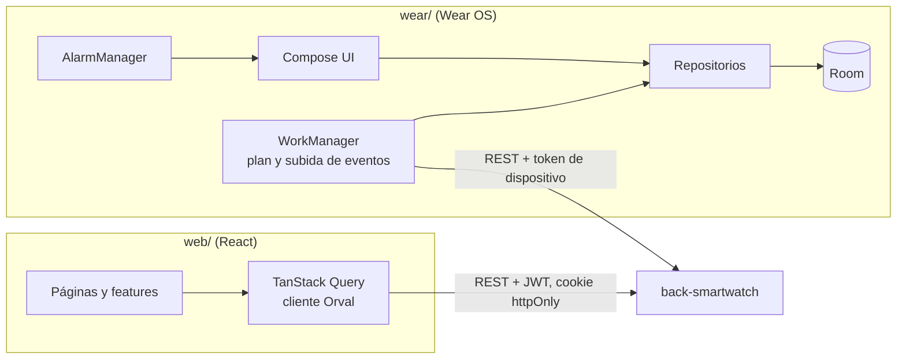

<div align="center">

# front-smartwatch

**Reloj Wear OS y panel web para gestionar recordatorios de medicamentos.**


</div>

## Tabla de contenido

1. [Acerca del proyecto](#acerca-del-proyecto)
2. [Características principales](#características-principales)
3. [Stack tecnológico](#stack-tecnológico)
4. [Arquitectura y cómo funciona](#arquitectura-y-cómo-funciona)
5. [Relación con el backend](#relación-con-el-backend)
6. [Instalación y ejecución](#instalación-y-ejecución)
7. [Estructura de carpetas](#estructura-de-carpetas)
8. [Cómo contribuir](#cómo-contribuir)
9. [Licencia](#licencia)

## Acerca del proyecto

`front-smartwatch` agrupa los dos clientes de un sistema de recordatorios de medicamentos pensado para personas que deben tomar medicación a sus horas y para los cuidadores que las acompañan. **No existe app de teléfono**:

- **`wear/`**: app **Wear OS independiente** (standalone), el producto principal. Alarma a cada hora de toma, permite marcar la dosis como tomada, pospuesta u omitida y funciona sin conexión.
- **`web/`**: **panel web** responsive donde el paciente o su cuidador carga medicamentos y horarios, consulta la adherencia, revisa reportes, configura notificaciones y vincula el reloj.

Ambos consumen la API del repositorio [`back-smartwatch`](https://github.com/StehvenObandoUcc/back-smartwatch).

## Características principales

### Reloj (`wear/`)

- Alarmas locales con `AlarmManager.setAlarmClock()`, que se reprograman tras reiniciar el reloj.
- Alerta de dosis con acciones **Tomada**, **Posponer 10 min** (máximo 3 veces) y **Omitir** con confirmación.
- **Funciona sin conexión**: el plan de 7 días y los eventos viven en Room; la red solo se usa para descargar el plan y subir eventos.
- Eventos con `eventId` UUID, subida en lote e idempotente mediante WorkManager con reintentos.
- Sincronización del plan con `ETag` y vinculación sin teclado mediante un código corto.
- Chat con asistente por voz: reconocimiento de voz, respuesta corta en pantalla y lectura con `TextToSpeech`.

### Panel web (`web/`)

- Registro, inicio de sesión, verificación de correo y recuperación de contraseña.
- Gestión de medicamentos y horarios, agenda y adherencia.
- Cuidadores e invitaciones, ajustes, notificaciones y reportes con descarga.
- Asistente de IA con respuesta en streaming (SSE).
- Sistema de diseño atómico con tokens propios, documentado en Storybook y con revisión de accesibilidad (axe).

## Stack tecnológico

| Cliente | Capa | Tecnología | Versión |
| --- | --- | --- | --- |
| Reloj | Lenguaje | Kotlin | 2.4.20 |
| Reloj | UI | Compose for Wear OS Material 3 | 1.7.0 |
| Reloj | Persistencia | Room | 2.8.5 |
| Reloj | Inyección de dependencias | Hilt | 2.60.1 |
| Reloj | Red | Retrofit + OkHttp + kotlinx.serialization | 3.0.0 / 5.5.0 / 1.11.0 |
| Reloj | Tareas en segundo plano | WorkManager | 2.12.0 |
| Reloj | Build | Android Gradle Plugin | 9.4.1 |
| Reloj | Plataforma | minSdk 33 · targetSdk 37 | — |
| Reloj | Calidad | ktlint, detekt, JUnit, Robolectric | 14.2.0 / 1.23.8 / 4.13.2 / 4.17 |
| Web | Framework | React | 19.2 |
| Web | Lenguaje y build | TypeScript (strict) + Vite | 6.0 / 8.3 |
| Web | Estilos | Tailwind CSS | 4.3 |
| Web | Enrutado | React Router | 8.4 |
| Web | Datos | TanStack Query | 5.104 |
| Web | Formularios | React Hook Form + Zod | 7.89 / 4.6 |
| Web | Cliente de API | Orval + mocks MSW | 8.39 / 2.15 |
| Web | Pruebas y documentación | Vitest, Testing Library, Playwright, Storybook | 5.0 / 16.3 / 1.63 / 10.6 |
| Web | Calidad | ESLint, Prettier | 9.39 / 3.9 |
| CI | GitHub Actions (`wear.yml`, `web.yml`) | — | — |

## Arquitectura y cómo funciona

Los clientes de API **se generan desde el contrato OpenAPI** del backend (openapi-generator para el reloj, Orval para la web), por lo que no se escriben a mano llamadas ni tipos que dupliquen el contrato.



### Flujo de punta a punta: una dosis

1. En el panel web se carga un medicamento con su horario y se vincula el reloj confirmando el código que este muestra.
2. `PlanSyncWorker` en el reloj descarga el plan con `GET /devices/me/plan` (usa `ETag`) y guarda las dosis en Room; `DoseAlarmScheduler` programa las alarmas locales.
3. A la hora de la dosis salta la alerta; la acción del usuario se guarda en Room como evento `PENDING` con un `eventId` UUID.
4. `EventUploader` envía los eventos en lote a `POST /devices/me/dose-events` y, cuando el backend los acepta, los marca como confirmados. Reenviar es seguro porque el backend es idempotente.
5. En el panel web, las páginas de adherencia y agenda muestran el historial y el porcentaje de adherencia calculados por el backend.

## Relación con el backend

Este repositorio es el cliente de [**back-smartwatch**](https://github.com/StehvenObandoUcc/back-smartwatch).

| Aspecto | Detalle |
| --- | --- |
| Protocolo | REST sobre HTTP con JSON en `camelCase`; SSE para el chat de la web |
| Contrato | `contracts/openapi.yaml` del backend. Aquí se fija un commit en [`contract.lock`](contract.lock) y [`scripts/sync-contract.sh`](scripts/sync-contract.sh) lo descarga a `.contract/` |
| Web | JWT de acceso en `Authorization: Bearer` (solo en memoria); refresh token en cookie `httpOnly` y renovación por `/auth/refresh` |
| Reloj | Vinculación por código (`/devices/pairing-codes`, `/devices/token`); renueva el token al recibir `401`; tokens en el almacén seguro del dispositivo |
| Errores | `application/problem+json` (RFC 9457) |
| URL de la API | Web: configurable en tiempo de compilación; reloj: `API_BASE_URL`, sobrescribible con `-PapiBaseUrl=<URL>` |

Endpoints que consume cada cliente:

| Cliente | Endpoints principales |
| --- | --- |
| Reloj | `POST /devices/pairing-codes`, `POST /devices/token`, `GET /devices/me/plan`, `POST /devices/me/dose-events`, `POST /devices/me/chat/messages` |
| Web | `/auth/*`, `/users/me/*`, `/patients`, `/patients/{patientId}/medications`, `/dose-history`, `/adherence`, `/reports`, `/chat/messages`, `POST /devices/pairing-codes/{code}/confirm` |

## Instalación y ejecución

### Requisitos

- Node.js 24 y npm (panel web).
- JDK 17 o superior y Android SDK (API 37) para el reloj; un AVD de Wear OS o un reloj físico. Crea `local.properties` con `sdk.dir=...` (no se versiona).
- [GitHub CLI](https://cli.github.com/) autenticado, para descargar el contrato con `scripts/sync-contract.sh`.
- El backend en ejecución. Mira las instrucciones en [`back-smartwatch`](https://github.com/StehvenObandoUcc/back-smartwatch).

### Contrato de la API

```sh
git clone https://github.com/StehvenObandoUcc/front-smartwatch.git
cd front-smartwatch
bash scripts/sync-contract.sh   # descarga el contrato fijado en contract.lock a .contract/openapi.yaml
```

### Panel web

Si necesitas apuntar a una API distinta de la local, crea tu propio archivo de entorno en `web/`; este README no documenta sus variables.

```sh
cd web
npm ci
npm run dev
```

| Comando | Qué hace |
| --- | --- |
| `npm run dev` | Servidor de desarrollo |
| `npm run build` | Typecheck y build de producción |
| `npm run lint` / `npm run typecheck` | ESLint y `tsc -b` |
| `npm run format` / `npm run format:check` | Prettier |
| `npm test` | Vitest: pruebas unitarias y cada historia en Chromium con revisión axe |
| `npm run storybook` | Storybook en `http://localhost:6006` |

La primera vez, para las pruebas de historias: `npx playwright install chromium`.

### Reloj Wear OS

```sh
cd wear
./gradlew ktlintCheck detekt test   # comprobaciones previas a cada push
./gradlew assembleDebug             # APK en app/build/outputs/apk/debug/
./gradlew installDebug              # instala en el emulador o reloj conectado
```

Desde el emulador, el equipo anfitrión es `10.0.2.2`. Para otra URL: `./gradlew installDebug -PapiBaseUrl=<URL>`.

Para probar la alarma con el reloj en reposo en el emulador: concede notificaciones y alarmas exactas desde Inicio, `adb shell input keyevent KEYCODE_SLEEP` y, si quieres forzar Doze, `adb shell dumpsys deviceidle force-idle`.

## Estructura de carpetas

```
front-smartwatch/
├── wear/                          App Wear OS (Kotlin)
│   ├── app/src/main/java/com/smartwatch/recordatorios/
│   │   ├── alarm/                     Programación de alarmas, notificaciones y acciones de dosis
│   │   ├── data/                      local/ (Room), remote/ (API, tokens, plan, eventos), repository/
│   │   ├── di/                        Módulos de Hilt
│   │   ├── sync/                      WorkManager: sincronización del plan y subida de eventos
│   │   └── ui/                        theme/, components/ y screens/ (home, pairing, today, alert, chat)
│   ├── api/                       Cliente de la API; api/generated se genera desde el contrato
│   └── config/detekt/             Reglas de detekt
├── web/                           Panel web (React + Vite)
│   ├── src/
│   │   ├── api/                       Cliente y mocks MSW generados con Orval
│   │   ├── app/                       Router, layout raíz y navegación
│   │   ├── components/                atoms/, molecules/ y templates/ (diseño atómico)
│   │   ├── design/tokens/             Tokens de diseño (CSS y TypeScript)
│   │   ├── features/                  Lógica por dominio: auth, caregivers, chat, medications, patients, plan, reports
│   │   ├── lib/                       Utilidades (cliente HTTP, fechas, errores)
│   │   ├── mocks/                     Mock Service Worker
│   │   └── pages/                     Pantallas
│   └── .storybook/                Configuración de Storybook
├── scripts/                       sync-contract.sh
├── docs/                          Plan de desarrollo
├── contract.lock                  Commit del contrato del backend que se consume
└── .github/workflows/             CI del reloj y de la web
```

## Cómo contribuir

1. Crea una rama desde `main` (`feat/<tema>`, `fix/<tema>`, `docs/<tema>`).
2. No escribas llamadas ni tipos de API a mano: si necesitas un cambio en la API, pídelo en el repositorio del backend y actualiza `contract.lock`.
3. En `web/`, respeta el diseño atómico (un átomo no conoce el dominio) y usa los tokens de `src/design/tokens`; el lint rechaza valores visuales literales fuera de ahí.
4. Antes de abrir el PR ejecuta las comprobaciones: `npm run lint`, `npm run format:check`, `npm run typecheck` y `npm test` en `web/`; `./gradlew ktlintCheck detekt test` en `wear/`.
5. Usa commits convencionales (`feat:`, `fix:`, `docs:`...) y abre un Pull Request pequeño que explique qué cambia y cómo se probó.

No incluyas secretos, tokens ni datos de salud en el código ni en los PR.

## Licencia

Por confirmar. El repositorio no incluye un archivo de licencia.
